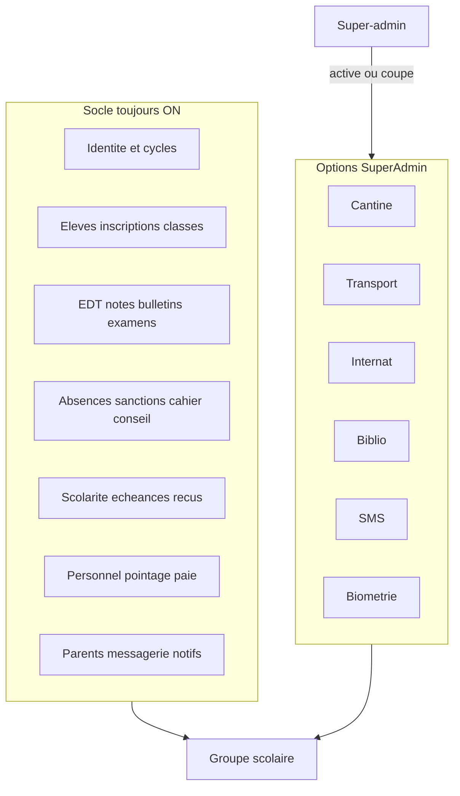
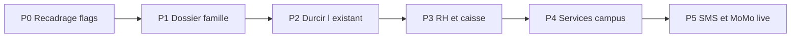

# Plan grand — GestSchool groupe scolaire PS → Tle

## Nouvelle doctrine

Le gel V1 ([server/src/config/v1Modules.js](server/src/config/v1Modules.js)) considérait EDT, absences, parents, sanctions et certificats comme « hors produit ». **Ce n’est plus l’objectif.** Un groupe scolaire privé congolais ne peut pas fonctionner sans eux.

Nouvelle règle :

- **Socle = tout ce qui est nécessaire** pour faire tourner un établissement PS → Tle (identifié ci-dessous). Activé **par défaut** à la création du tenant.
- **Options** = services que l’école n’a pas forcément (cantine, transport, internat, bibliothèque, biométrie, SMS). Présents dans le produit, **OFF par défaut**, activables.
- **Super-admin** = maître des interrupteurs par école (plus de blocage par plan `starter` / `pro`). Les plans restent un **libellé de facturation**, pas un plafond fonctionnel.
- Le directeur **voit** les modules ; il ne les retire pas. Seul le super-admin désactive (évite qu’une école se casse le métier en coupant les inscriptions).

`enforceModuleConstraints()` doit cesser d’éteindre EDT/parents/absences selon le plan. Il ne force plus que les 4 critiques (élèves, classes, inscriptions, paiements) à ON.

## Couverture métier — ce qu’une école PS→Tle doit pouvoir faire

Inventaire calé sur le dépôt actuel ([server/prisma/schema.prisma](server/prisma/schema.prisma)).

### A. Déjà dans le code — à sortir du gel et à durcir

| Domaine | État | Action |
|---|---|---|
| Multi-tenant, white-label, rôles, JWT | Prêt | Conserver |
| Cycles via `concerneCycles` + niveaux officiels Congo | Prêt | Premier classeur UX : un tenant = groupe PS–Tle, pas un seul `typeEtablissement` |
| Inscriptions, échéances, caisse, reçus PDF, dépenses | Prêt | Catalogue de frais annexes (l’enum `TypePaiement` a déjà cantine/transport/uniforme, **sans internat**) |
| Notes, bulletins, conseil, cahier de textes | Prêt | Tests d’intégration sur le calcul de moyenne / rang |
| EDT, salles, conflits | Codé, OFF par défaut | **ON par défaut** |
| Absences / retards / justificatifs | Codé, OFF | **ON par défaut** |
| Portail parents | Codé, OFF | **ON par défaut** |
| Sanctions, certificats, actualités, messagerie, calendrier, examens nationaux | Codé | **ON par défaut** ; créer le flag Prisma `moduleActualites` (aujourd’hui listé dans `v1Modules.js` mais absent de `TenantConfig`) |
| Pointage enseignants + paie | Lot ouvert, non commité | Terminer et activer comme **socle RH** (désactivable si l’école n’a pas de paie informatisée) |

### B. Trous bloquants — indispensables, absents ou trop faibles

Sans ça, ce n’est pas une gestion scolaire complète, même avec tous les modules actuels ON.

1. **Famille réelle** — un seul `Eleve.parentId` vers `User`. Il faut des **tuteurs multiples** (père, mère, tuteur légal, payeur) + contact d’urgence. Aujourd’hui le portail et les relances cassent dès qu’il n’y a pas « le » parent.
2. **Dossier élève administratif** — pièces (acte de naissance, photos, carnet de vaccination), allergies / PAI léger, nationalité. Composant UI `DocumentUpload` sans modèle métier.
3. **Passage d’année multi-cycles** — la décision fin d’année existe ; il manque un runbook fluide **par cycle** (PS→GS, CM2→6e, 3e→2nde, Tle) avec capacités des classes cibles et droits d’inscription N+1.
4. **Personnel non enseignant** — `StaffRole` n’a pas planton, chauffeur, cuisinier, infirmier. Le pointage est calé sur l’EDT enseignant : inadapté au personnel ATD.
5. **Mobile Money réel** — [server/src/services/momo.sandbox.js](server/src/services/momo.sandbox.js) est une simulation. En production Afrique, la caisse parents sans MoMo live (MTN / Airtel / Orange) reste incomplète.
6. **SMS** — e-mail + Socket.IO ne suffisent pas : absences du matin et relances d’impayés passent par SMS.

### C. Options d’établissement (flags vides aujourd’hui)

Les booléens `moduleBiblio` / `moduleCantine` / `moduleTransport` n’ont **aucune route**. À construire comme options SuperAdmin, branchées sur la caisse existante (`inscriptionId` + `TypePaiement`).

| Option | Cœur fonctionnel | Lien finance |
|---|---|---|
| **Cantine** | Inscription demi-pension / internat-repas, menus semaine, absences repas | `TypePaiement.cantine` déjà là |
| **Transport** | Lignes, arrêts, élève ↔ ligne, présence bus | `TypePaiement.transport` déjà là |
| **Internat** | Nouveau module : chambres, internés, appel du soir | Ajouter `TypePaiement.internat` |
| **Bibliothèque** | Catalogue, emprunt, retard, amende | `TypePaiement.bibliotheque` déjà là |
| **Infirmerie** | Visites, traitements, alerte allergies (léger, pas un DPI) | Option, pas un ERP santé |

Hors cible volontaire (pas « nécessaire » au quotidien d’un groupe scolaire) : LMS type Moodle, app native, badge NFC élève, export Sage/OHADA complet, multi-pays autres que le référentiel Congo. On les note en V3.

## Catalogue modules Super-admin (cible)

Fichiers à aligner : [server/src/config/v1Modules.js](server/src/config/v1Modules.js), [client/src/pages/superadmin/constants.js](client/src/pages/superadmin/constants.js), [client/src/pages/admin/Configuration.jsx](client/src/pages/admin/Configuration.jsx) (aujourd’hui désaligné : `moduleAbsences` vs `modulePresences`).

**Socle (ON, super-admin peut couper sauf les 4 locked)**

- Élèves, classes, inscriptions, paiements (locked)
- Matières / programme, EDT, salles
- Notes, bulletins, conseil, cahier de textes, examens, certificats
- Absences, sanctions, calendrier, actualités, messagerie
- Portail parents
- Personnel, rapports
- Pointage + paie (coupables si l’école gère la paie ailleurs)

**Options (OFF)**

- Cantine, transport, internat, bibliothèque, infirmerie, SMS, biométrie pointage

## Phasage d’exécution

On ne code pas tout d’un coup. Chaque phase livre un établissement **plus complet**, pas un prototype parallèle.

### P0 — Recadrage produit (quelques jours, aucun nouveau métier)

- Remplacer le gel : `V1_FROZEN_OFF` disparaît ; `moduleFlagsForPlan()` allume le socle pour tout nouveau tenant ; `enforceModuleConstraints()` ne verrouille plus sur le plan.
- Super-admin : toggles libres + 4 locked. Directeur : lecture seule des modules (page Configuration = thème, horaires, devises, pas le catalogue).
- Unifier les noms (`modulePresences` partout ; créer `moduleActualites` en Prisma).
- Défaut création tenant : `concerneCycles = [prescolaire, primaire, college, lycee]`, `typeEtablissement = groupe_scolaire`.
- Mettre à jour README / briefing pour tuer l’ancien gel.

### P1 — Dossier élève et famille (fondation manquante)

- Modèle `EleveTuteur` (rôle, payeur principal, accès portail) à la place du seul `parentId`.
- `EleveDocument` (type, fichier Cloudinary, date).
- Champs médicaux légers sur `Eleve` (allergies, groupe sanguin, PAI).
- UI inscriptions + fiche élève + relances qui ciblent le **payeur**, pas « le » parent.

### P2 — Durcir ce qui est déjà écrit

- Sortir EDT / absences / parents / sanctions / certificats du OFF.
- Tests Vitest : `inscriptions/validate`, calcul bulletin, isolation `Note`, conflits EDT.
- Supprimer le spec pharmacie [e2e/02-flux-vente.spec.js](e2e/02-flux-vente.spec.js) ; étendre le smoke aux 4 cycles.
- Finir le lot RH déjà ouvert (pointage + heures + paie) en PRs séparées, pas un diff unique.
- Passage d’année : éligibles + lot **filtrés par cycle**, alertes capacité classe cible.

### P3 — RH réel + caisse école

- Rôles ATD (`personnel` / ou rôles fins : chauffeur, cuisinier, surveillant internat).
- Pointage journalier **sans EDT** pour le non-enseignant.
- Catalogue de frais par classe/cycle (scolarité + options) générant les échéances à l’inscription.
- Bourse / réduction fratrie (pourcentage ou montant, appliqué aux échéances).
- Clôture de caisse journalière (un caissier, un total, un PDF déjà amorcé via `journalCaisse.pdf.js`).
- Protéger ou retirer `GET /api/health/bootstrap`.

### P4 — Services de campus (options)

Ordre recommandé, parce que branchés sur la caisse déjà là :

1. Cantine (le plus demandé en maternelle/primaire)
2. Transport
3. Internat (surtout collège/lycée du groupe)
4. Bibliothèque
5. Infirmerie minimale (lecture allergies + registre visites)

Chaque option : modèles Prisma + routes + pages admin + ligne de facturation sur l’inscription + interrupteur SuperAdmin.

### P5 — Canal Afrique

- Passerelle SMS (Africa’s Talking ou équivalent) : absence du jour, relance échéance, mot de passe temporaire.
- MoMo live derrière le même contrat que le sandbox (intent → webhook → `Paiement`).
- 2FA staff (`forcer2FA` existe sans TOTP) — option SuperAdmin, pas socle.

## Fichiers piliers du recadrage (P0)

- [server/src/config/v1Modules.js](server/src/config/v1Modules.js) — socle vs options, plus de freeze
- [server/prisma/schema.prisma](server/prisma/schema.prisma) — `moduleActualites`, plus tard tuteurs / internat
- [server/src/controllers/config.controller.js](server/src/controllers/config.controller.js) + [server/src/controllers/superadmin.controller.js](server/src/controllers/superadmin.controller.js)
- [client/src/pages/superadmin/constants.js](client/src/pages/superadmin/constants.js) + SuperAdminPanel
- [client/src/pages/admin/Configuration.jsx](client/src/pages/admin/Configuration.jsx) + [client/src/components/layouts/navConfig.js](client/src/components/layouts/navConfig.js)
- Seed démo : un groupe PS–Tle avec socle ON, options OFF

## Ce qu’on ne fait pas dans ce plan

- Réécrire le multi-tenant (il est sain).
- Activer biométrie élèves / NFC avant que le pointage enseignants ne soit stable.
- App mobile native (le PWA + SMS couvrent le terrain).
- Multi-pays (Cameroun, CI…) avant qu’un groupe CG pilote n’ait vécu une année complète.
